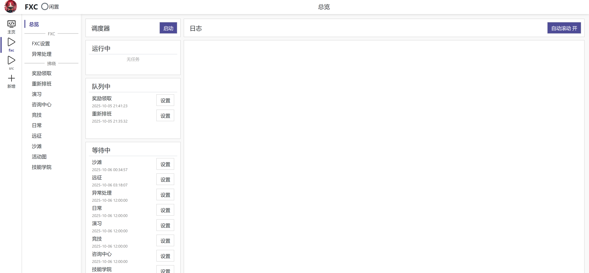

# FXCopilot

Fork 自[StarRailCopilot](https://github.com/LmeSzinc/StarRailCopilot)
基于SRC的Alas框架

# 运行方法
1. git clone 该项目
2. 本地准备好uv
3. 使用uv创建好本地的python 虚拟环境 v3.10
4. uv sync
5. python ./gui.py 
6. 访问 http://localhost:22367/

exe打包coming soon

让MLXR多些时间陪家人，少些时间玩二游

最后， 有男不玩

# TODO
- [X] 主线挂机
- [ ] 远征10小时1600油检查
- [X] 邮件检查
- [X] 初始代码删除，部分代码重构
- [ ] 活动挂机精细控制(针对船捞满后打到油点自动退出)
- [ ] 活动挂机超过X油启动？
- [ ] 防卫战挂机
- [X] 每日任务
- [X] 通行证任务
- [X] 登陆相关
- [ ] 活动后台适配
- [X] 每日礼包
- [X] 每周礼包
- [X] exe打包(点[这里](https://github.com/hxx0215/FXCopilot/releases))
